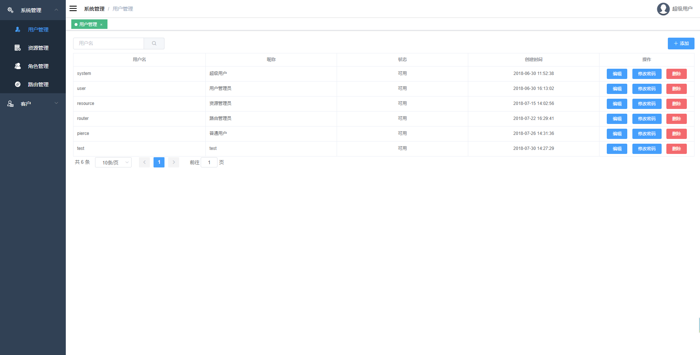
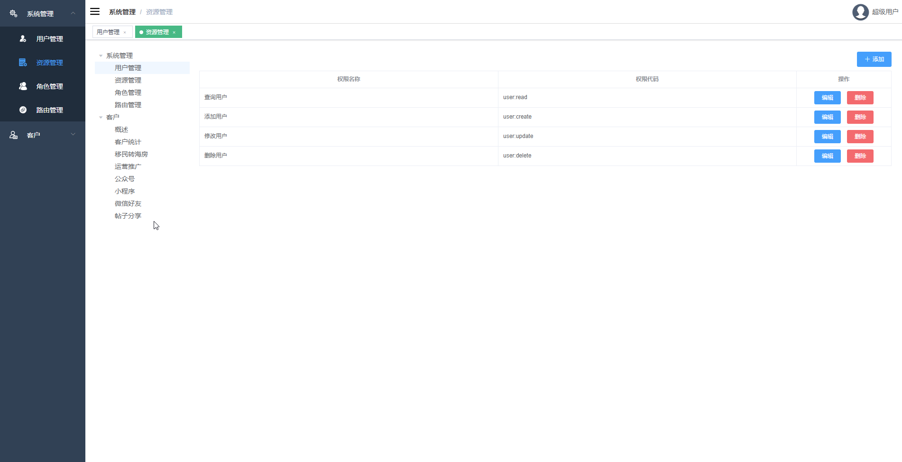
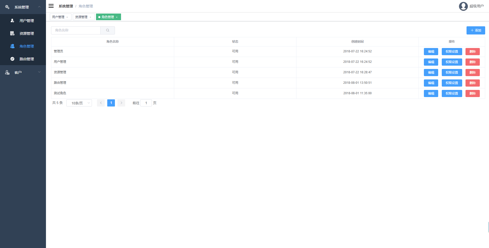
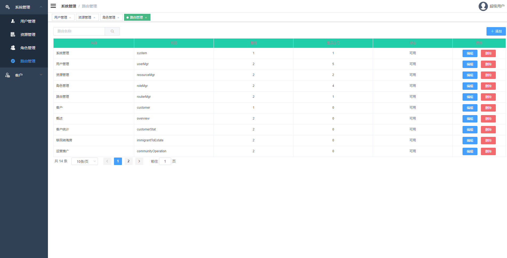

# backstage-dashboard-fe
> Dynamic Router Dashboard with Authority Management

## Build Setup

``` bash
# install dependencies
npm install

# serve with hot reload at localhost:8080
npm run dev

# build for production with minification
npm run build

# build for production and view the bundle analyzer report
npm run build --report
```

## Functions

### System Management
* [x] User Management
* [x] Resource Management
* [x] Role Management
* [x] Router Management

### Customer Stat Chart
* [ ] Multiple Y Axes
* [ ] Multidimensional bar chart
* [ ] Stacking histogram
* [ ] Export Table To Excel

## Backend Project
> [backstage-dashboard-be](https://github.com/PierceTsu/backstage-dashboard-be)

## Sample



